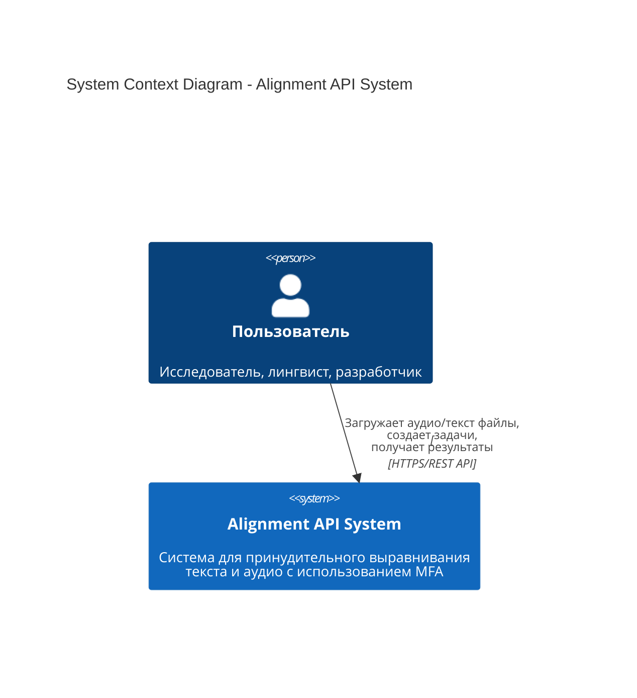
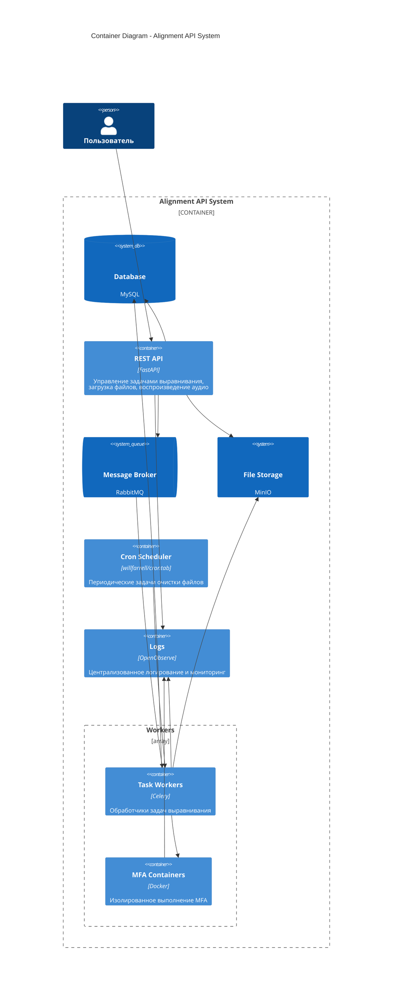
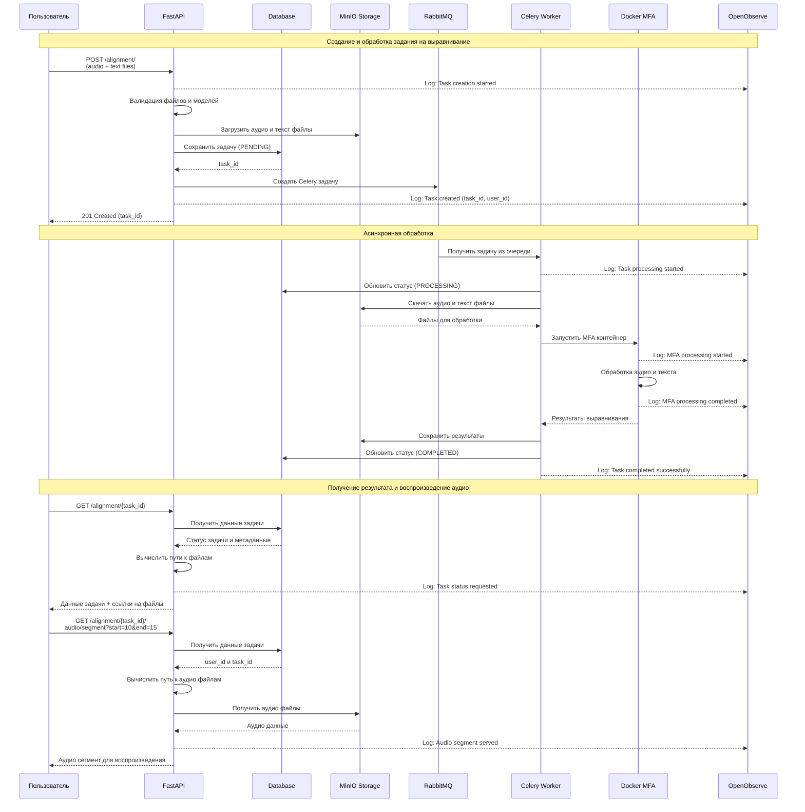
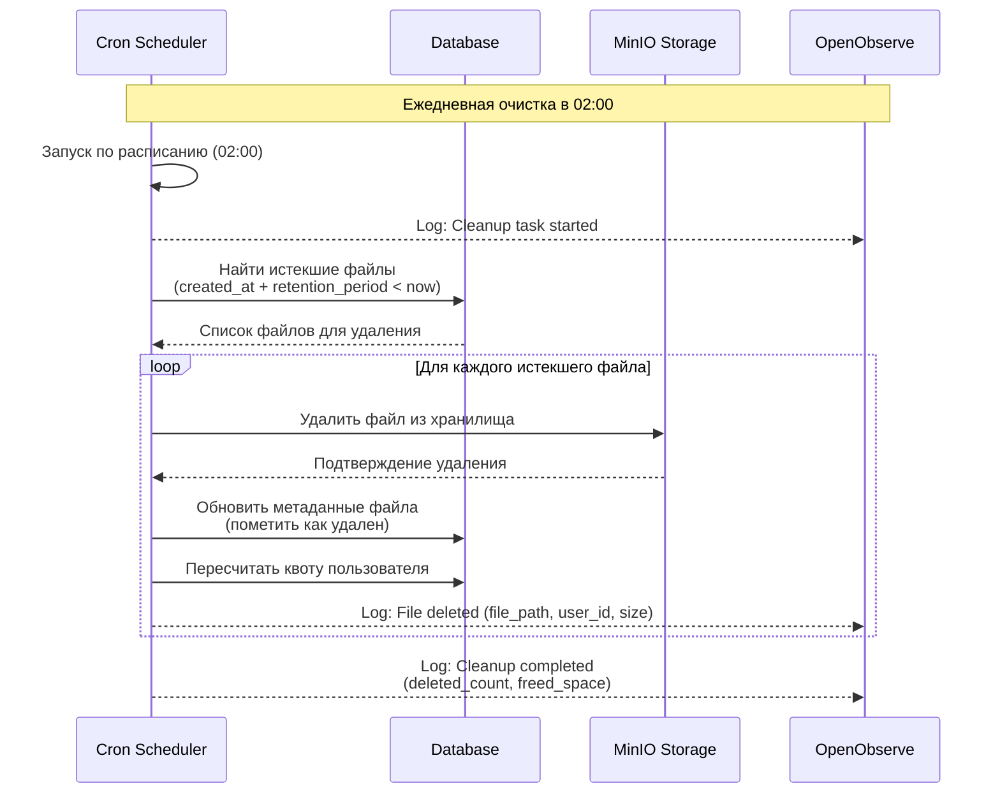
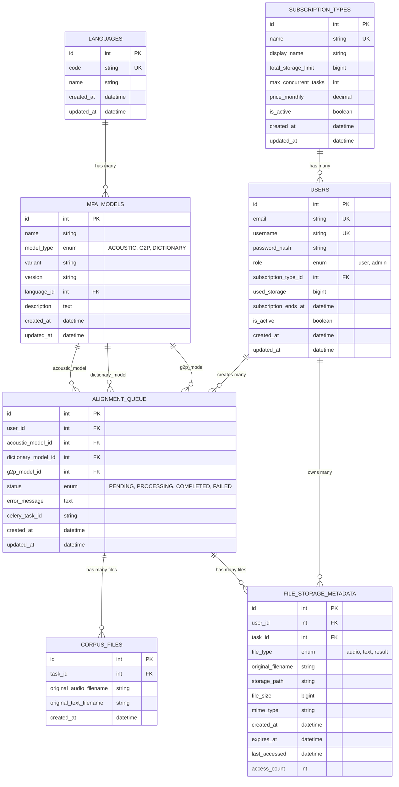

# Архитектура системы выравнивания текста и аудио


## Обзор системы

Система представляет собой распределенное приложение для обработки задач принудительного выравнивания текста и аудио с использованием Montreal Forced Aligner (MFA). Архитектура построена на принципах Domain-Driven Design (DDD) с асинхронной обработкой задач через Celery и RabbitMQ.


## Основные компоненты

### 1. API (FastAPI)
- **Назначение**: REST API для управления задачами выравнивания
- **Компоненты**:
  - Домены: `alignment`, `models`, `auth`, `users`
  - Аутентификация и авторизация
  - Прием задач на выравнивание от пользователей, постановка их в очередь
  - предоставление результатов обработки пользователям
  - API для воспроизведения аудио сегментов
- **Технологии**: FastAPI, Pydantic, SQLAlchemy

### 2. Message Broker (RabbitMQ)
- **Назначение**: Очередь сообщений для асинхронных задач
- **Функции**:
  - Надежная доставка задач на выравнивание к Workers
  - Мониторинг через RabbitMQ Management UI

### 3. Workers (Celery)
- **Назначение**: Обработчики задач выравнивания
- **Функции**:
  - Получение задач из очереди RabbitMQ
  - Скачивание файлов из MinIO для обработки
  - Запуск MFA в изолированных Docker контейнерах
  - Сохранение результатов JSON в MinIO
  - Обновление статусов задач в БД

### 4. Database (MySQL)
- **Назначение**: Персистентное хранение данных
- **Функции (хранимая информация)**:
  - Каталог MFA моделей и поддерживаемых языков
  - Данные пользователей и аутентификация
  - Пользовательские подписки и лимиты
  - Метаданные задач с привязкой к пользователям
  - Метаданные файлов для lifecycle management
  - История выполнения задач

### 5. File Storage (MinIO)
- **Назначение**: S3-совместимое объектное хранилище
- **Функции**:
  - Хранение аудиофайлов и текстовых файлов корпуса
  - Хранение результатов выравнивания (JSON)
  - Быстрый доступ для API воспроизведения аудио

### 6. Docker MFA Containers
- **Назначение**: Изолированное выполнение Montreal Forced Aligner
- **Функции**:
  - Обработка аудио и текста в изолированной среде
  - Генерация результатов выравнивания в формате JSON
  - Автоматическое масштабирование по количеству задач

### 7. Периодические задачи (Crontab)
- **Назначение**: Выполнение периодических задач по расписанию
- **Функции**:
  - Очистка устаревших файлов и пересчет квот пользователей
- **Технологии**: willfarrell/crontab Docker image

### 8. OpenObserve
- **Назначение**: Централизованное логирование и мониторинг
- **Функции**:
  - Сбор логов от всех компонентов (FastAPI, Celery, Docker)
  - Поиск и анализ логов через Web UI
  - Дашборды для мониторинга производительности


## Структура проекта

### Структура каталогов проекта (сокращенная)

```
alignment-api/
├── docker-compose.yml          # Основной compose файл
├── api/                        # FastAPI приложение
│   ├── domains/                # Доменная логика (DDD)
│   │   ├── alignment/
│   │   ├── models/
│   │   ├── users/
│   │   └── auth/
│   └── tests/
├── workers/                    # Celery workers
│   ├── tasks/                  # Celery задачи
│   ├── services/               # Сервисы для workers
│   └── tests/
├── cleanup/                    # Скрипты cron очистки
│   └── tests/
├── shared/                     # Общий код между всеми компонентами
│   ├── database/               # Модели БД и подключения
│   ├── storage/                # MinIO интеграция
│   ├── logging/                # OpenObserve интеграция
│   └── tests/
└── docs/                       # Документация
```

### Изоляция конфигурации и тестов:
- Каждый компонент имеет свой `config.py`
- Каждый компонент имеет свои тесты в `tests/`
- Общие настройки в `shared/`
- Environment переменные в `.env` файлах


## Architecture Diagrams

### С4 Level 1: System Context Diagram



### С4 Level 2: Container Diagram




### Диаграмма последовательности успешной обработки задания



## Диаграмма последовательности периодической очистки файлов




## Файловое хранилище и lifecycle management

### Типы файлов и их жизненный цикл

| Тип файла | Хранение | Срок жизни | Назначение |
|-----------|----------|------------|------------|
| **Файлы корпуса (аудио/текст)** | MinIO | Краткосрочно* | API воспроизведения сегментов |
| **Результаты (JSON)** | MinIO | Долгосрочно/Всегда* | Данные выравнивания, повторные скачивания |
| **История задач** | Database | Всегда | Метаданные, статистика, биллинг |

*_Срок зависит от подписки пользователя_

### Структура хранения в MinIO

```
alignment-storage/
└── {user_id}/
    ├── corpus/                    # Исходные файлы корпуса
    │   └── {task_id}/
    │       ├── {corpus_file_id}.wav    # Аудиофайл с ID из CORPUS_FILES
    │       ├── {corpus_file_id}.txt    # Текстовый файл с тем же ID
    │       ├── {corpus_file_id}.wav    # Следующая пара
    │       ├── {corpus_file_id}.txt
    │       └── ...
    └── results/                   # Результаты выравнивания (долгосрочно)
        └── {task_id}/
            ├── {corpus_file_id}.json   # Результат для файла с данным ID
            ├── {corpus_file_id}.json   # Результат для следующего файла
            └── ...
```

**Логика именования файлов:**
- `{corpus_file_id}` - ID записи из таблицы `CORPUS_FILES` (например: 15, 23, 47, ...)
- Аудио и текстовые файлы имеют одинаковый `corpus_file_id`
- Результаты выравнивания сохраняются с тем же `corpus_file_id`


## API endpoints

#### Домен Alignment (`/alignment/`)
```
# Управление задачами выравнивания
POST   /alignment/                    # Создать задачу выравнивания (поддержка множественных файлов)
GET    /alignment/                    # Получить список задач (с фильтром по статусу)
GET    /alignment/{task_id}           # Получить задачу по ID
GET    /alignment/{task_id}/files     # Получить список файлов корпуса
PUT    /alignment/{task_id}           # Обновить задачу
DELETE /alignment/{task_id}           # Удалить задачу
```

#### Домен Models (`/models/`)
```
GET    /models/                       # Получить все модели (с фильтрами)
GET    /models/languages              # Получить языки
POST   /models/update                 # Обновить модели из репозитория
```

#### Аутентификация (`/auth/`)
```
POST   /auth/register                 # Регистрация пользователя
POST   /auth/login                    # Вход в систему
GET    /auth/me                       # Информация о текущем пользователе
```

#### Пользователи (`/users/`)
```
GET    /users/quota                   # Квоты пользователя
```

#### API для работы с аудио и файлами корпуса
```
# Воспроизведение сегментов аудио из конкретного файла корпуса
GET /alignment/{task_id}/audio/{corpus_file_id}/segment?start=10.5&end=15.2
GET /alignment/{task_id}/audio/{corpus_file_id}/word?word=hello

# Скачивание файлов корпуса
GET /alignment/{task_id}/download/corpus                    # Скачать весь корпус (zip)
GET /alignment/{task_id}/download/audio/{corpus_file_id}    # Скачать конкретный аудиофайл
GET /alignment/{task_id}/download/text/{corpus_file_id}     # Скачать конкретный текстовый файл
GET /alignment/{task_id}/download/result/{corpus_file_id}   # Скачать результат для конкретной пары
GET /alignment/{task_id}/download/results                   # Скачать все результаты (zip)
GET /alignment/{task_id}/download/all                       # Скачать корпус + результаты (zip)
```

#### Мониторинг (`/health/`)
```
GET    /health                        # Общий статус системы
GET    /health/database               # Статус базы данных
GET    /health/rabbitmq               # Статус RabbitMQ
GET    /health/minio                  # Статус MinIO
GET    /health/celery                 # Статус Celery workers
```


## Структура базы данных

### ER диаграмма



### Описание таблиц

**`alignment_queue`** - Очередь задач выравнивания (Основная таблица для хранения задач MFA)

**`corpus_files`** - Файлы корпуса (Хранит информацию о каждой паре аудио/текст файлов в задании)

**`languages`** - Справочник языков (Поддерживаемые языки для MFA моделей)

**`mfa_models`** - Каталог MFA моделей (Акустические модели, словари, G2P модели)

**`subscription_types`** - Типы подписок (Справочник тарифных планов с лимитами)

**`users`** - Пользователи системы (Управление пользователями и аутентификация, Привязка к типу подписки, Отслеживание текущего использования ресурсов)

**`file_storage_metadata`** - Метаданные файлов (Отслеживание файлов в MinIO хранилище, Связь файлов с пользователями и задачами, Lifecycle management)


## Подписки

### Квоты

| Подписка | Хранилище | Срок хранения файлов | Параллельные задачи |
|----------|-----------|------------|-------------------|
| Free | 1 GB | 3 дня | 1 |
| Basic | 10 GB | 30 дней после окончания подписки* | 3 |
| Pro | 100 GB | 30 дней после окончания подписки* | 10 |
| Enterprise | 1 TB | 30 дней после окончания подписки* | максимально возможное |

*В случае продления подписки, срок хранения файлов продлевается

### Ограничения
- **Максимальный размер аудиофайла**: 50MB
- **Максимальный размер текстового файла**: 1MB
- **Максимальная длительность аудио**: 2 часа


## Дополнительно

### Статусы задач

| Статус | Описание | Где устанавливается |
|--------|----------|-------------------|
| `PENDING` | Задача создана, ожидает обработки | FastAPI при создании |
| `PROCESSING` | Задача выполняется | Celery Worker при старте |
| `COMPLETED` | Задача успешно завершена | Celery Worker при успехе |
| `FAILED` | Задача завершена с ошибкой | Celery Worker при ошибке |
| `CANCELLED` | Задача отменена пользователем | FastAPI при отмене |


### Горизонтальное масштабирование
- **Celery Workers**: Можно запускать на разных серверах
- **RabbitMQ**: Кластеризация для высокой нагрузки
- **FastAPI**: Load balancer + несколько инстансов
- **MinIO**: Distributed mode для отказоустойчивости

### Логирование и мониторинг
- **OpenObserve**: Централизованное логирование и мониторинг
  - Сбор логов от всех компонентов (FastAPI, Celery, Docker)
  - Поиск и анализ логов через Web UI
  - Алерты и уведомления при ошибках
  - Дашборды для мониторинга производительности
- **Celery Flower**: Web UI для мониторинга задач и workers
- **RabbitMQ Management**: Мониторинг очередей и подключений
- **Structured Logging**: JSON формат для всех компонентов
- **Health Checks в API**: Проверка состояния всех сервисов

### Базовая обработка ошибок
- **Exception Handling**: Перехват и логирование всех ошибок
- **Status Updates**: Обновление статуса задачи на FAILED при ошибке
- **Error Messages**: Сохранение описания ошибки в БД
- **File Cleanup**: Удаление временных файлов при ошибках

### Cron-based очистка
- **Cron Schedule**: Ежедневная задача очистки в 02:00 через willfarrell/crontab
- **Cleanup Scripts**: `cleanup/cleanup_expired.py` и `cleanup/cleanup_errors.py`
- **File Retention Logic**:
  - Free подписка: файлы удаляются через 3 дня после создания
  - Платные подписки: файлы удаляются через 30 дней после окончания подписки (`subscription_ends_at + 30 days`)
  - Активные подписки: файлы не удаляются
- **MinIO Deletion**: Удаление файлов из объектного хранилища
- **Metadata Cleanup**: Удаление записей из `file_storage_metadata`
- **User Quota Update**: Обновление `used_storage` для пользователей
- **Cleanup Logs**: Логирование всех операций очистки в OpenObserve
- **Statistics**: Количество удаленных файлов и освобожденного места
- **Dry Run Mode**: Возможность тестового запуска без удаления

### Безопасность
- **JWT Tokens**: Stateless аутентификация
- **File Validation**: Проверка типов и содержимого файлов
- **Audit Logging**: Логирование всех действий

### Простая retry логика
- **Celery Built-in Retry**: Максимум 1 повтор при ошибке
- **Manual Restart**: Пользователь может перезапустить failed задачу через API

### Персистентность данных
- **Database**: Все метаданные сохраняются в MySQL
- **File Storage**: Файлы хранятся в MinIO
- **RabbitMQ Persistence**: Сообщения сохраняются на диск
- **Task Status**: Отслеживание состояния через БД

### Изоляция процессов
- **Docker Containers**: Каждая задача в отдельном контейнере
- **Resource Limits**: Ограничения CPU/Memory

### Валидация данных
- **File Type Validation**: Проверка форматов аудио/текста
- **Model Validation**: Проверка существования моделей MFA
- **Rate Limiting**: Ограничение одновременно выполняемых задач
