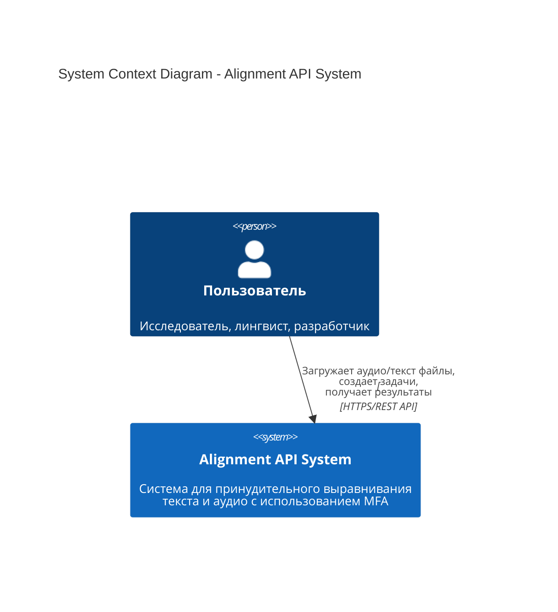
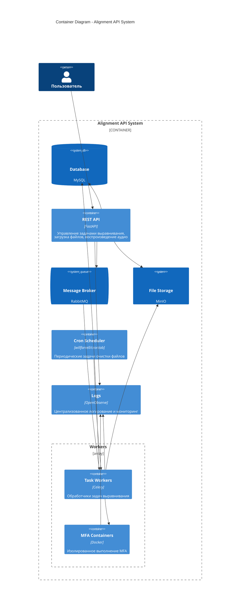
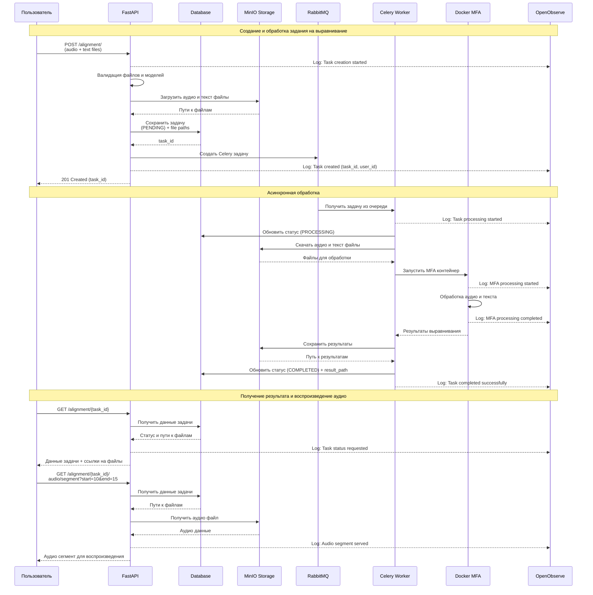
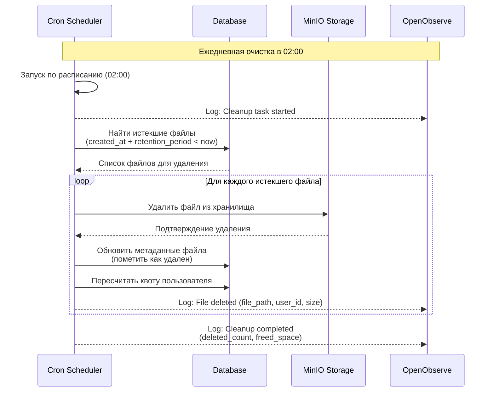
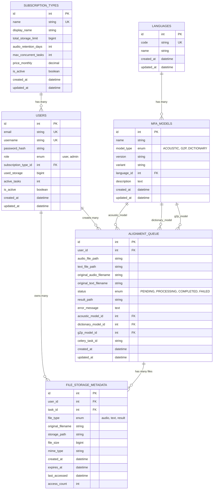

# Архитектура системы выравнивания текста и аудио

## Обзор системы

Система представляет собой распределенное приложение для обработки задач принудительного выравнивания текста и аудио с использованием Montreal Forced Aligner (MFA). Архитектура построена на принципах Domain-Driven Design (DDD) с асинхронной обработкой задач через Celery и RabbitMQ.

## Основные компоненты

### 1. FastAPI Application (Web API)
- **Назначение**: REST API для управления задачами выравнивания
- **Компоненты**:
  - Домены: `alignment`, `models`, `users`
  - Аутентификация и авторизация (JWT)
  - Валидация входных данных
  - API для воспроизведения аудио сегментов
- **Технологии**: FastAPI, Pydantic, SQLAlchemy

### 2. Message Broker (RabbitMQ)
- **Назначение**: Очередь сообщений для асинхронных задач
- **Функции**:
  - Надежная доставка задач Celery с персистентностью
  - Dead Letter Queue для обработки failed задач
  - Мониторинг через RabbitMQ Management UI

### 3. Celery Workers
- **Назначение**: Обработчики задач выравнивания
- **Функции**:
  - Получение задач из RabbitMQ очереди
  - Скачивание файлов из MinIO для обработки
  - Запуск MFA в изолированных Docker контейнерах
  - Сохранение результатов JSON в MinIO
  - Обновление статусов задач в БД

### 4. Database (MySQL)
- **Назначение**: Персистентное хранение данных
- **Функции**:
  - Управление пользователями и аутентификация
  - Метаданные задач с привязкой к пользователям
  - Каталог MFA моделей и поддерживаемых языков
  - Пользовательские подписки и лимиты
  - Метаданные файлов для lifecycle management
  - История выполнения задач

### 5. File Storage (MinIO)
- **Назначение**: S3-совместимое объектное хранилище
- **Функции**:
  - Хранение аудиофайлов корпуса (предположительно недолго)
  - Хранение текстовых файлов корпуса (предположительно недолго)
  - Хранение результатов выравнивания JSON (длительное хранение)
  - Быстрый доступ для API воспроизведения аудио

### 6. Docker MFA Containers
- **Назначение**: Изолированное выполнение Montreal Forced Aligner
- **Функции**:
  - Обработка аудио и текста в изолированной среде
  - Генерация результатов выравнивания в формате JSON
  - Автоматическое масштабирование по количеству задач
  - Ограничение ресурсов (CPU/Memory) на контейнер

### 7. Cron Scheduler (Периодические задачи)
- **Назначение**: Выполнение периодических задач по расписанию
- **Функции**:
  - Очистка истекших файлов (ежедневно в 02:00)
  - Пересчет квот пользователей
  - Архивирование старых логов
  - Maintenance задачи
- **Технологии**: willfarrell/crontab Docker image

### 8. OpenObserve
- **Назначение**: Централизованное логирование и мониторинг
- **Функции**:
  - Сбор логов от всех компонентов (FastAPI, Celery, Docker)
  - Поиск и анализ логов через Web UI
  - Дашборды для мониторинга производительности

## C4 Architecture Diagrams

### Level 1: System Context Diagram



### Level 2: Container Diagram



## Диаграмма последовательности успешной обработки задания



## Диаграмма последовательности периодической очистки файлов



## Файловое хранилище и lifecycle management

### Типы файлов и их жизненный цикл

| Тип файла | Хранение | Срок жизни | Назначение |
|-----------|----------|------------|------------|
| **Файлы корпуса (аудио/текст)** | MinIO | Краткосрочно* | API воспроизведения сегментов |
| **Результаты (JSON)** | MinIO | Долгосрочно/Всегда | Данные выравнивания, повторные скачивания |
| **История задач** | Database | Всегда | Метаданные, статистика, биллинг |

*_Срок зависит от подписки пользователя_

### Структура хранения в MinIO

```
alignment-storage/
└── {user_id}/
    ├── corpus/                    # Исходные файлы (краткосрочно)
    │   └── {task_id}/
    │       ├── 1.wav
    │       ├── 1.txt
    │       ├── ...
    │       ├── N.wav
    │       └── N.txt
    └── results/                   # Результаты (долгосрочно)
        └── {task_id}/
            ├── 1.json
            ├── ...
            └── N.json
```

### Существующие API endpoints

#### Домен Alignment (`/alignment/`)
```
# Управление задачами выравнивания
POST   /alignment/                    # Создать задачу выравнивания
GET    /alignment/                    # Получить список задач
GET    /alignment/{task_id}           # Получить задачу по ID
PUT    /alignment/{task_id}           # Обновить задачу
DELETE /alignment/{task_id}           # Удалить задачу
GET    /alignment/status/{status}     # Получить задачи по статусу
```

#### Домен Models (`/models/`)
```
# Управление MFA моделями
GET    /models/                       # Получить все модели
GET    /models/by-type/{model_type}   # Получить модели по типу
GET    /models/languages              # Получить языки
POST   /models/update                 # Обновить модели из репозитория
```

#### Аутентификация (`/auth/`)
```
POST   /auth/register                 # Регистрация пользователя
POST   /auth/login                    # Вход в систему
GET    /auth/me                       # Информация о текущем пользователе
```

#### Пользователи (`/users/`)
```
GET    /users/quota                   # Квоты пользователя
```

#### API для работы с аудио
```
# Воспроизведение сегментов аудио
GET /alignment/{task_id}/audio/segment?start=10.5&end=15.2
GET /alignment/{task_id}/audio/word?word=hello

# Скачивание файлов
GET /alignment/{task_id}/download/audio
GET /alignment/{task_id}/download/text
GET /alignment/{task_id}/download/result
GET /alignment/{task_id}/download/all
```

#### Мониторинг (`/health/`)
```
GET    /health                        # Общий статус системы
GET    /health/database               # Статус базы данных
GET    /health/rabbitmq               # Статус RabbitMQ
GET    /health/minio                  # Статус MinIO
GET    /health/celery                 # Статус Celery workers
```

## Структура базы данных

### ER диаграмма



### Описание таблиц

#### Существующие таблицы (из миграций)

**`alignment_queue`** - Очередь задач выравнивания
- Основная таблица для хранения задач MFA
- Содержит пути к файлам, статусы, параметры моделей

**`languages`** - Справочник языков
- Поддерживаемые языки для MFA моделей

**`mfa_models`** - Каталог MFA моделей
- Акустические модели, словари, G2P модели
- Связана с языками через `language_id`

**`subscription_types`** - Типы подписок
- **Назначение**: Справочник тарифных планов с лимитами
- **Функции**:
  - Определение лимитов хранилища по подпискам
  - Контроль срока хранения файлов
  - Ограничение параллельных задач
  - Ценообразование и биллинг
  - Управление доступностью тарифов

**`users`** - Пользователи системы
- **Назначение**: Управление пользователями и аутентификация
- **Функции**:
  - Хранение учетных данных пользователей
  - Управление ролями (user, admin)
  - Привязка к типу подписки через `subscription_type_id`
  - Отслеживание текущего использования ресурсов
  - Контроль активности аккаунтов

**`file_storage_metadata`** - Метаданные файлов
- **Назначение**: Отслеживание файлов в MinIO хранилище
- **Функции**:
  - Связь файлов с пользователями и задачами
  - Lifecycle management через поле `expires_at`
  - Статистика доступа к файлам
  - Контроль размеров и типов файлов
  - Поддержка автоматической очистки через Celery задачи

#### Расширенная таблица задач

**`alignment_queue`** - Очередь задач выравнивания (расширенная)
- **Назначение**: Управление задачами выравнивания с поддержкой пользователей
- **Функции**:
  - Связь задач с пользователями через `user_id`
  - Отслеживание Celery задач через `celery_task_id`
  - Хранение параметров MFA моделей
  - Мониторинг статусов и результатов
  - Поддержка многопользовательского режима


## Подписки

### Квоты

| Подписка | Хранилище | Срок аудио | Параллельные задачи |
|----------|-----------|------------|-------------------|
| Free | 1 GB | 7 дней | 1 |
| Basic | 10 GB | 30 дней | 3 |
| Pro | 100 GB | 365 дней | 10 |
| Enterprise | 1 TB | бессрочно | максимально возможное |

### Ограничения
- **Максимальный размер аудиофайла**: 50MB
- **Максимальный размер текстового файла**: 1MB
- **Максимальная длительность аудио**: 2 часа

# Дополнительно

### Статусы задач

| Статус | Описание | Где устанавливается |
|--------|----------|-------------------|
| `PENDING` | Задача создана, ожидает обработки | FastAPI при создании |
| `PROCESSING` | Задача выполняется | Celery Worker при старте |
| `COMPLETED` | Задача успешно завершена | Celery Worker при успехе |
| `FAILED` | Задача завершена с ошибкой | Celery Worker при ошибке |
| `CANCELLED` | Задача отменена пользователем | FastAPI при отмене |


### Горизонтальное масштабирование
- **Celery Workers**: Можно запускать на разных серверах
- **RabbitMQ**: Кластеризация для высокой нагрузки
- **FastAPI**: Load balancer + несколько инстансов
- **MinIO**: Distributed mode для отказоустойчивости

### Логирование и мониторинг
- **OpenObserve**: Централизованное логирование и мониторинг
  - Сбор логов от всех компонентов (FastAPI, Celery, Docker)
  - Поиск и анализ логов через Web UI
  - Алерты и уведомления при ошибках
  - Дашборды для мониторинга производительности
- **Celery Flower**: Web UI для мониторинга задач и workers
- **RabbitMQ Management**: Мониторинг очередей и подключений
- **Structured Logging**: JSON формат для всех компонентов
- **Health Checks**: Проверка состояния всех сервисов

## Обработка ошибок (упрощенная)

### Базовая обработка ошибок
- **Exception Handling**: Перехват и логирование всех ошибок
- **Status Updates**: Обновление статуса задачи на FAILED при ошибке
- **Error Messages**: Сохранение описания ошибки в БД
- **File Cleanup**: Удаление временных файлов при ошибках

## Автоматическая очистка файлов

### Celery периодические задачи
- **Cleanup Task**: Ежедневная задача очистки в 02:00
- **Expired Files Check**: Поиск файлов с `expires_at < now()`
- **MinIO Deletion**: Удаление файлов из объектного хранилища
- **Metadata Cleanup**: Удаление записей из `file_storage_metadata`
- **User Quota Update**: Обновление `used_storage` для пользователей

### Мониторинг очистки
- **Cleanup Logs**: Логирование всех операций очистки в OpenObserve
- **Statistics**: Количество удаленных файлов и освобожденного места
- **Error Handling**: Обработка ошибок при удалении файлов
- **Dry Run Mode**: Возможность тестового запуска без удаления

### Простая retry логика (опционально)
- **Celery Built-in Retry**: Максимум 1 повтор при ошибке
- **No Complex Logic**: Без exponential backoff и сложных стратегий
- **Manual Restart**: Пользователь может перезапустить failed задачу через API

## Безопасность

### Аутентификация и авторизация
- **JWT Tokens**: Stateless аутентификация
- **Role-based Access**: Разграничение прав (user/admin)
- **API Rate Limiting**: Защита от злоупотреблений
- **CORS Configuration**: Контроль cross-origin запросов

### Защита данных
- **File Validation**: Проверка типов и содержимого файлов
- **Input Sanitization**: Очистка пользовательского ввода
- **Secure File Storage**: Изоляция файлов пользователей
- **Audit Logging**: Логирование всех действий пользователей контейнеров

## Отказоустойчивость (базовая)

### Персистентность данных
- **Database**: Все метаданные сохраняются в MySQL
- **File Storage**: Файлы хранятся в MinIO
- **RabbitMQ Persistence**: Сообщения сохраняются на диск
- **Task Status**: Отслеживание состояния через БД

### Мониторинг состояния
- **Health Checks**: Простые проверки доступности сервисов
- **OpenObserve Integration**: Централизованный сбор логов и метрик
- **Real-time Monitoring**: Отслеживание состояния задач и сервисов

## Безопасность

### Изоляция процессов
- **Docker Containers**: Каждая задача в отдельном контейнере
- **Resource Limits**: Ограничения CPU/Memory
- **Network Isolation**: Контейнеры без доступа в интернет
- **File Permissions**: Ограниченный доступ к файловой системе

### Валидация данных
- **File Type Validation**: Проверка форматов аудио/текста
- **Model Validation**: Проверка существования моделей MFA
- **Input Sanitization**: Очистка пользовательских данных
- **Rate Limiting**: Ограничение частоты запросов

## Структура проекта

### Целевая структура каталогов (сокращенная)

```
alignment-api/
├── docker-compose.yml          # Основной compose файл
├── api/                        # FastAPI приложение
│   ├── domains/                # Доменная логика (DDD)
│   │   ├── alignment/
│   │   ├── models/
│   │   ├── users/
│   │   └── auth/
│   └── tests/
├── workers/                    # Celery workers
│   ├── tasks/                  # Celery задачи
│   ├── services/               # Сервисы для workers
│   └── tests/
├── cleanup/                    # Скрипты cron очистки
│   └── tests/
├── shared/                     # Общий код между всеми компонентами
│   ├── database/               # Модели БД и подключения
│   ├── storage/                # MinIO интеграция
│   ├── logging/                # OpenObserve интеграция
│   └── tests/
└── docs/                       # Документация
```

### Ключевые изменения структуры

#### **Разделение ответственности:**
- **`api/`**: Только FastAPI приложение (переименовано из `app/`)
- **`workers/`**: Только Celery workers и задачи
- **`cleanup/`**: Отдельные скрипты для cron очистки
- **`shared/`**: Общий код между всеми компонентами

#### **Docker контейнеры:**
- **FastAPI**: Использует код из `api/` + `shared/`
- **Celery Workers**: Использует код из `workers/` + `shared/`
- **Cron Cleanup**: Использует код из `cleanup/` + `shared/`

#### **Новые домены в API:**
- **`users/`**: Управление пользователями и квотами
- **`auth/`**: Аутентификация и JWT токены

#### **Изоляция конфигурации:**
- Каждый компонент имеет свой `config.py`
- Общие настройки в `shared/`
- Environment переменные в `.env`
